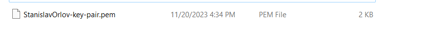
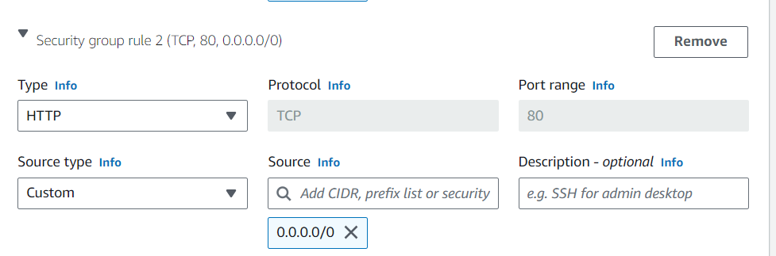
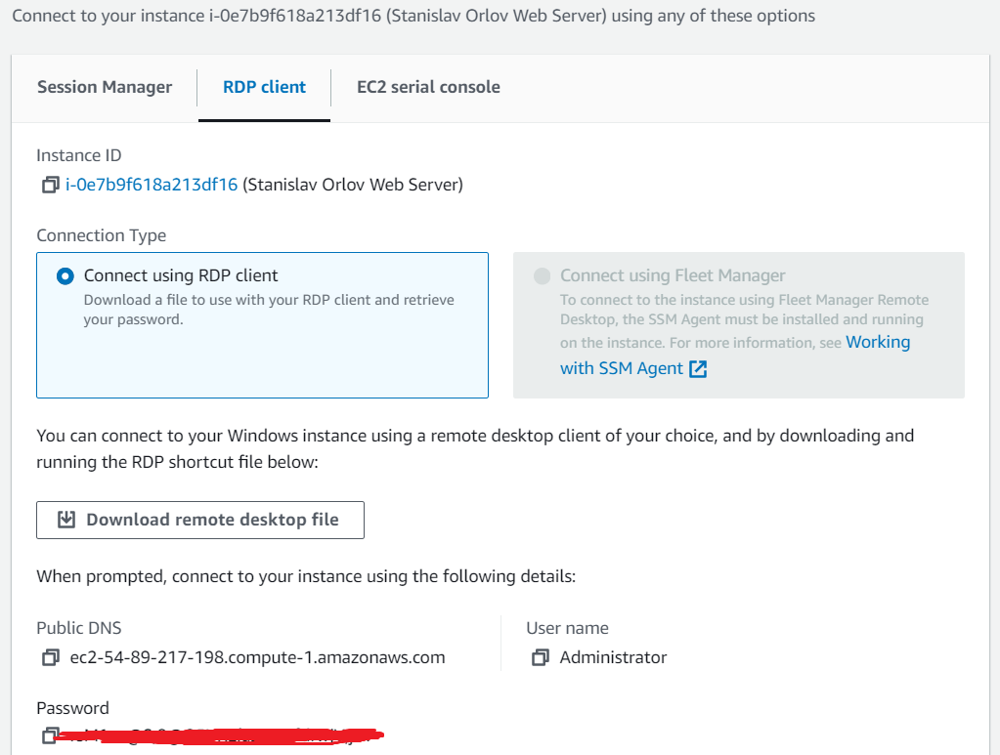
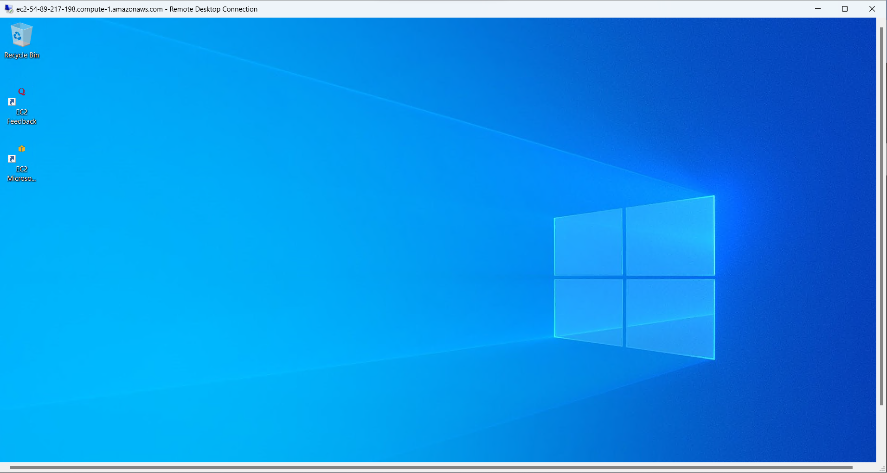

НАЦІОНАЛЬНИЙ АЕРОКОСМІЧНИЙ УНІВЕРСИТЕТ ім. М. Є. Жуковського
«Харківський авіаційний інститут»

Факультет радіоелектроніки, комп'ютерних систем та інфокумунікацій

Кафедра комп'ютерних систем, мереж і кібербезпеки

Лабораторна робота №2

З диципліни: «Теорія та технології розроблення безпечних розподільних
систем»

Виконав:

студент [5 курсу групи №555 ім]{.underline}

Напряму підготовки

[125 Кібербезпека та захист інформації]{.underline}

ст. [Орлов Станіслав Валерійович]{.underline}

Прийняв:

аспірант

[Карпенко Андрій Сергійович]{.underline}

Харків, 2023

# Step 1 Creating Windows Server VM

1.  Launching Amazon EC2 instance console

{width="6.5in"
height="2.8916666666666666in"}

# Step 2 Launching Windows Server VM on Amazon EC2 instance

1.  Choosing base image for Windows Server

{width="6.5in"
height="4.184722222222222in"}

2.  Choosing Instance type

{width="6.5in"
height="2.3777777777777778in"}

3.  Generating new key pair login

{width="6.5in"
height="2.279166666666667in"}

Assigning name as "\[You Name\] Web Server" tag

{width="6.350550087489064in"
height="6.525565398075241in"}

Downloaded Key Pair

{width="6.5in"
height="0.47638888888888886in"}

4.  Configuring Network settings

Adding Rule to open 80 port (HTTP) in addition to 3389 (RDP)

Opening RDP 3389 port

{width="6.5in"
height="2.2777777777777777in"}

Opening HTTP port 80

{width="6.5in"
height="2.1486111111111112in"}

5.  Configuring storage with assigned volumes

{width="6.5in"
height="3.7381944444444444in"}

6.  Configurating startup script

{width="4.517058180227472in"
height="6.8255916447944in"}

7.  Launching instance

{width="6.5in"
height="0.8076388888888889in"}

Instance in a running state

{width="6.5in"
height="0.8513888888888889in"}

{width="6.5in"
height="3.183333333333333in"}

8.  Connecting to Windows Server by using Microsoft Remote Desktop
    client.

{width="6.5in"
height="4.908333333333333in"}

{width="6.5in"
height="3.470833333333333in"}

9.  Opening Server Manager to make sure IIS Web Server is running

{width="6.5in"
height="5.160416666666666in"}

Creating IN Bound Firewall rule to access WebSite page

{width="6.5in"
height="0.9888888888888889in"}

10. Checking **wwwroot** folder of the IIS to see content of WebSite

{width="6.5in"
height="2.060416666666667in"}

11. Opening default web page created by IIS server to check if
    everything is properly configured.

{width="6.5in"
height="3.4652777777777777in"}

# Task 2 Creating Linux Ubuntu VM

Choosing Name on Linux instance

{width="6.5in"
height="2.688888888888889in"}

Choosing Amazon machine image

{width="6.5in"
height="4.404861111111111in"}

Choosing instance type

{width="6.5in"
height="2.216666666666667in"}

Security group

{width="6.5in"
height="4.281944444444444in"}

Launching Linux instance

{width="6.5in"
height="2.85625in"}

Connecting to EC2 Linux instance via SSH

{width="6.5in"
height="4.802083333333333in"}

{width="6.5in"
height="1.1958333333333333in"}

Connecting to Linux virtual machine via Windows terminal and SSH

{width="6.5in"
height="1.2055555555555555in"}

Terminating all instances

{width="6.5in"
height="1.023611111111111in"}

Висновки:

У ході виконання даннох лабораторної роботи ознайомився з AWS EC2
сервісом Амазон для створення Linux/Windows віртуальних машин для
розгортання веб серверу. Отримав навички конфігурування для підключення
ствоерних віртуальних машин та конфігурування базового веб сервісу.
