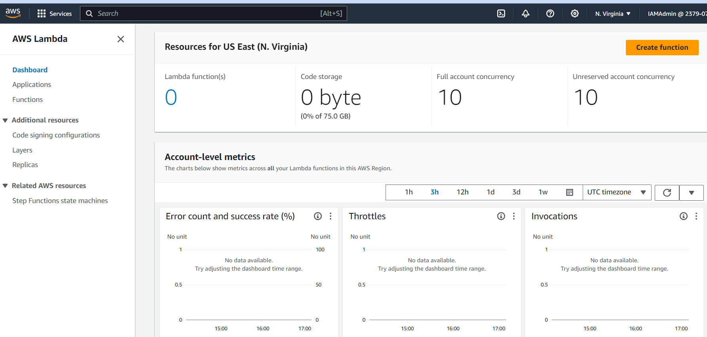
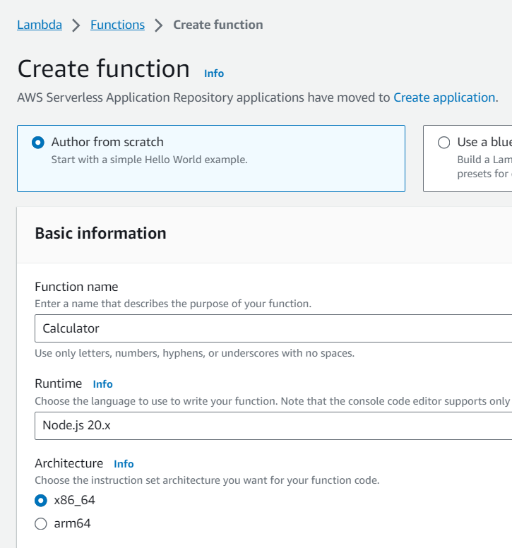
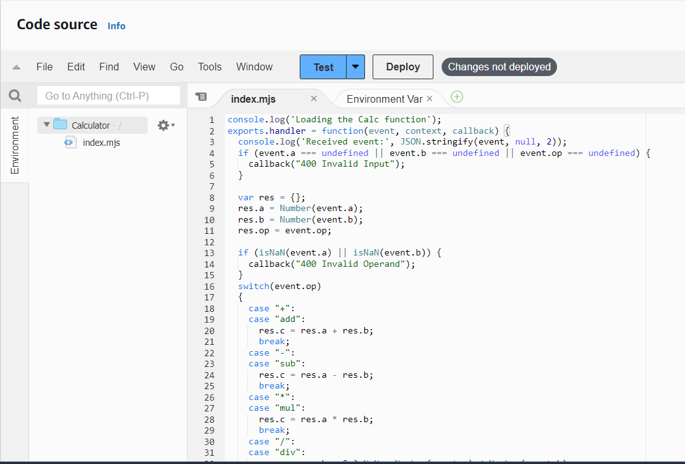
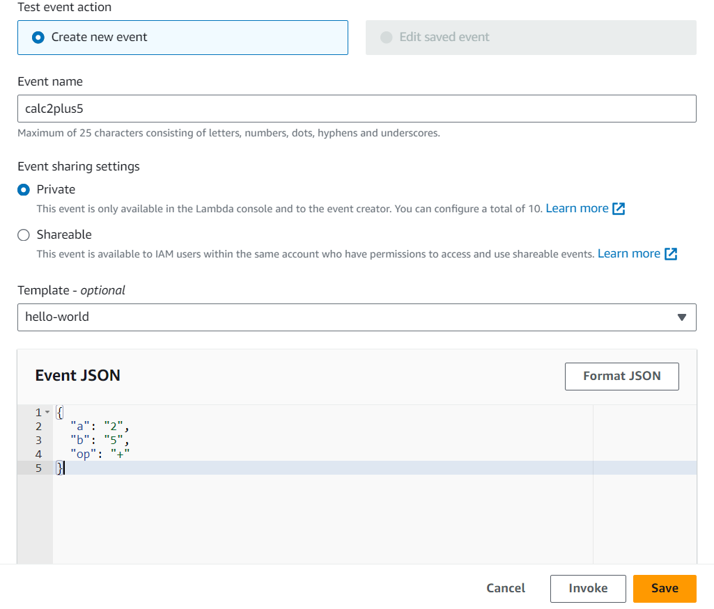
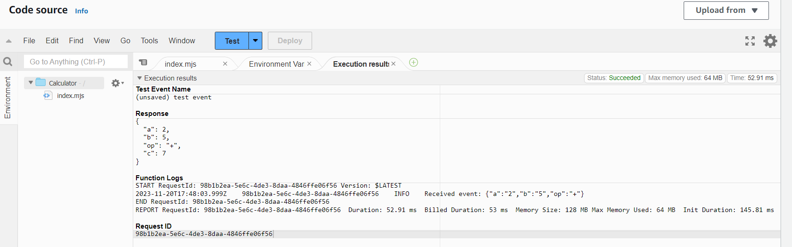
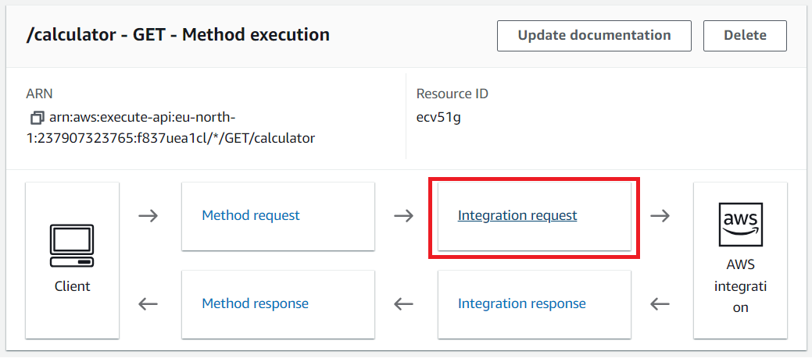
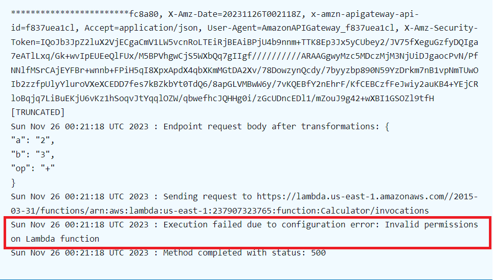
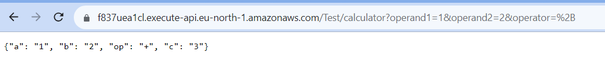
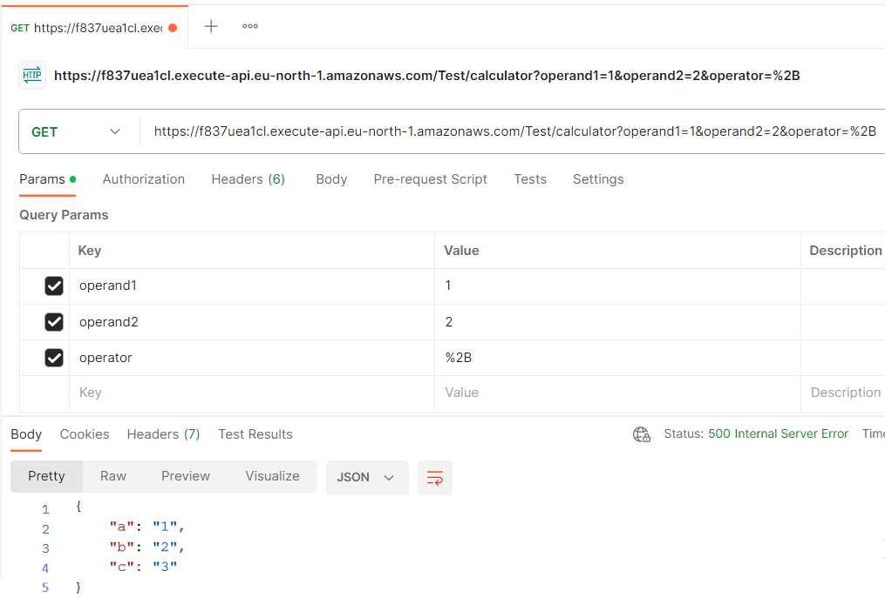

НАЦІОНАЛЬНИЙ АЕРОКОСМІЧНИЙ УНІВЕРСИТЕТ ім. М. Є. Жуковського
«Харківський авіаційний інститут»

Факультет радіоелектроніки, комп'ютерних систем та інфокумунікацій

Кафедра комп'ютерних систем, мереж і кібербезпеки

Лабораторна робота №3

З диципліни: «Теорія та технології розроблення безпечних розподільних
систем»

Виконав:

студент [5 курсу групи №555 ім]{.underline}

Напряму підготовки

[125 Кібербезпека та захист інформації]{.underline}

ст. [Орлов Станіслав Валерійович]{.underline}

Прийняв:

аспірант

[Карпенко Андрій Сергійович]{.underline}

Харків, 2023

# Step 0 Preparation and Logging to AWS management console

Авторизуємося у консолі управління AWS та виберемо та відкриємо сервіс
AWS Lambda.

{width="6.5in"
height="3.1041666666666665in"}

Рисунок 1 -- AWS Lambda Console

# Step 1 Creating a Calculator Lambda function

1.  Creating AWS Lambda function

Скористаємося пунктом меню "Create Function" та перейдемо до створення
лямбда функції, вказавши імя «Calculator» та зазначивши Node.js як
середовище виконання.

{width="5.902497812773404in"
height="6.317707786526684in"}

Рисунок 2 -- створення AWS Lambda function

Відкриємо редактор вихідного коду через Lambda Console та додамо
наступний вихідний JS код.

{width="6.5in"
height="4.401388888888889in"}

Рисунок 3 -- вихідний код Lambda function "Calculator"

Збережемо зміни нашої функції та задеплоємо її для подальшого
користування за допомогою меню "Deploy".

# Step 2: Testing the Calculator Lambda function

Перейдемо безпосередньо до тестування вихідної лямбда функції. Створена
функція очікую три вхідні параметри: «a,b» та «op». Параметри «a,b»
являють собою операнди та мають числовий або строковий тип. Параметр
«op» являє собою строку та має одне з чотирьох значень: +, -, /, \*.

Виконаємо операцію додавання двох чисел за допомгою нашою функції: 2 та
5, створивши відповідно нову трігер подію.

{width="6.5in"
height="5.548611111111111in"}

Рисунок 4 -- тригер додавання чисел для тестування функції

{width="6.5in"
height="2.0319444444444446in"}

Рисунок 5 -- результат виконання функціі калькуляції calc2plus5

# Step 3: Configuring permissions and trust relations

1\. Proceed to the Configuration -\> Permission tab and choose the role
created by default

Перейдемо до налаштування пермісій для ролі, за допомгою якої
виконується наша функція. Для виконання нашої функції було створено нову
роль «Calculator-role-j12...».

{width="6.5in"
height="2.7534722222222223in"}

Рисунок 6 -- роль підя якою виконується лямбда фунцкції

2\. You will be redirected to the IAM console where you can specify
role's permissions and trust relations.

{width="6.5in"
height="1.9013888888888888in"}

Рисунок 7 -- перехід на IAM консоль для встановлення пермісій для ролі

3\. Replace the default permission policy with the new one.

Відкриємо консоль модифікування дозволів нашої ролі.

{width="6.5in"
height="2.1125in"}

Рисунок 8 -- зміна існуючої Policy

4\. Choose Review policy and Save changes and close this tab.

{width="6.5in"
height="2.939583333333333in"}

Рисунок 9 -- перевірка та створення налаштувань дозволу

5\. In the Roles settings select role's Trust relationships tab

{width="6.5in"
height="2.120138888888889in"}

Рисунок 10 -- налаштування Trust policy

Replace the existing policy with the following:

{width="6.5in"
height="4.139583333333333in"}

Рисунок 11 -- зміна Trust policy

Make a note of the role ARN for the role you just created. You\'ll need
it later.

{width="6.5in"
height="1.9034722222222222in"}

Рисунок 12 -- занатовування ARN

**Calculator-role-1ixogsku:**
"arn:aws:iam::237907323765:role/service-role/Calculator-role-1ixogsku"

**Function ARN**:
"arn:aws:lambda:us-east-1:237907323765:function:Calculator"

# Step 4: Creating a Web API for the Calculator Lambda function

1.  Sign Into the Gateway API console at
    <https://console.aws.amazon.com/apigateway.>

2.  Creating REST API Gateway

{width="6.5in"
height="2.1173611111111112in"}

Рисунок 13 -- створення REST API Gateway

3.  Filling API details

Leave the Description blank and leave the Endpoint Type set to Regional.

{width="4.866126421697288in"
height="3.5549748468941385in"}

Рисунок 14 -- заповнення даних API Gateway

# Step 5 Integration -- Creating HTTP methods to call the Lambda Function

1.  Create a GET method with query parameters to call the Lambda
    function

{width="5.279627077865267in"
height="3.131676509186352in"}

Рисунок 15 -- створення нового ресурсу для створеного API Gateway

2.  Create a GET method

У якості Integration type виберемр AWS Service. Для значення AWS Region
виберемо регіон e.g., us-east-1. Для значення AWS Service задамо Lambda.

{width="6.5in"
height="5.1722222222222225in"}

Рисунок 16 -- створення нового HTTP Get методу

Залишимо AWS Subdomain пустим. Для HTTP method виберемо POST.

Зазначемо «Use path override» у якості значення Action Type та задамо
наступне значення:
«/2015-03-31/functions/arn:aws:lambda:region:account-id:function:Calculator/invocations».

Для ролі виконання зазначемо ARN для IAM ролі створеної раніше.

{width="6.5in"
height="5.040972222222222in"}

Рисунок 17 -- налаштування деталей HTTP методу

{width="3.758659230096238in"
height="0.5583814523184601in"}

Рисунок 18 -- успішне створення методу

3.  Choose **Method Request**

Choose the pencil icon next to Request Validator and choose Validate
query string parameters and headers from the drop-down menu.

{width="6.5in"
height="3.7805555555555554in"}

Рисунок 19 -- додавання валідації вхідних параметрів запиту

Expand the URL Query String Parameters section. Choose Add query string.

For Name, type operand1. Repeat the previous steps to create parameters
named operand2 and operator. Check the Required option for each
parameter to ensure that they are validated.

{width="6.5in"
height="2.732638888888889in"}

Рисунок 20 -- створення вхідних параметрів та їх валадація

4.  Choose Method Execution at the top of the page and then choose
    Integration Request to set up the mapping template to translate the
    client-supplied query strings to the integration request payload as
    required by the Calc function.

{width="6.492361111111111in"
height="2.8715277777777777in"}

Рисунок 21 -- модифікація Integration Request для додавання мапінгу
перекладу вхідних параметрів рядку запиту до інтеграціного запиту
функції

5.  Expand the Mapping Templates section.

{width="5.1359525371828525in"
height="3.888728127734033in"}

Рисунок 22 -- створення шаблону мапінгу

6.  Перевіримо створену функцію виконавши запит з вкладки Test

{width="6.5in"
height="3.3402777777777777in"}

Рисунок 23 -- перевірка та виконання лямбда функції

Отримали помилку:

{width="6.5in"
height="3.26875in"}

Рисунок 24 -- мопилка під час виконання функції

{width="6.5in"
height="3.6972222222222224in"}

Рисунок 25 -- мопилка під час виконання функції

Повернемося до створенної функції та за допомогою вкладки "Monitor" -\>
перейдемо до меню CloudWatch logs подивитися причину помилки.

{width="6.5in"
height="1.4381944444444446in"}

Рисунок 26 -- перегляд помилки при виконанні лямбда функції

{width="6.400554461942257in"
height="4.858754374453193in"}

{width="6.058858267716535in"
height="3.2502821522309713in"}

Рисунок 27 -- модифікаця функція згідно новоно стандарту

Виконаємо деплой функції.

# Step 6. Deploying and testing the API

1.  Виконаємо деплой API через контекстне меню

{width="5.422152230971129in"
height="2.6763188976377954in"}

Створимо новий стейдж та виконаємо деплой натискаючи кнопку «Deploy»

{width="5.255650699912511in"
height="5.011687445319335in"}

{width="6.5in"
height="2.4347222222222222in"}

2.  Виконаємо запит через браузер

{width="6.5in"
height="0.6847222222222222in"}

3.  Виконаємо запит через утиліту Postman

{width="6.5in"
height="4.39375in"}

# Step 7. Un-deploying the API and delete the Lambda function

{width="6.5in"
height="1.35625in"}

{width="6.5in"
height="1.1729166666666666in"}

Висновки:

У ході виконання даннох лабораторної роботи ознайомився з AWS Lambda
Function сервісом Амазон для безсервесних додатків. Отримав навички
конфігурування пермісій даних функцій для їх виклики через Amazon API
Gateway.

Посилання на GitHub

<https://github.com/stanislavorlov/SecureDistibutedSystems/tree/master/Lab3>
